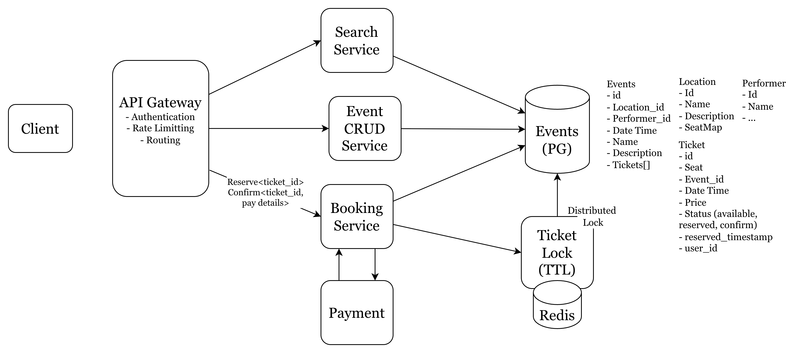
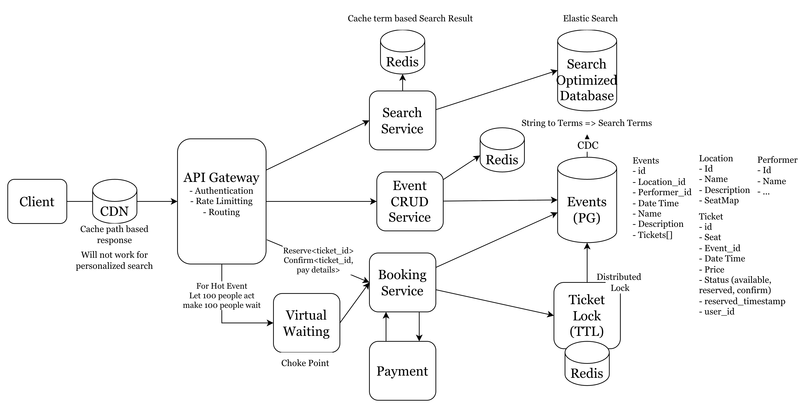

# Design Ticket Master - An online ticket booking site

Allows users to buy tickets online for concerts, sport events theater and other live entertainment.

## Functional Requirements (Features of the system) [User should be able X]

- User should be able to view the events
- User should be able to search for the events
- User should be able to book tickets for the events

### System Scale

- 100M daily Usres, 100K events per day

## Non-Functional Requirements (Quality of the system) [What makes the system challenging?]

- Low latency search
- Consistency >> Availability | No Double Booking
- High availability for Searching and booking tickets
- Read >> Write (Read write ratio)
- Query access pattern | Scalability to handle certain popular events

## Out of scope

- `GDPR` compliance.

> Ask the interviewer if he want to change anything form these two sections. Make sure you two are same page.

## Core Entities
> What data is persisted in the system, and what will be transferred through API?

- Event | Adding events is out of scope
- Location
- Performer
- Ticket

> No problem if we can't jump into the detailed fields now.

## APIs

> Look to your functional requirements and make some APIs for those functional requirements, make sure to exchange those Entities through the API.

- `GET` /event/:event_id -> Event, Location, Performer and Ticket[]
- `GET` /search?term={term}&location={location}&type={category}&date={date_range} -> partial<Event>[]
- `POST` /booking/reserve 
```json
header: JWT | Session Token
body{
    ticketId
}
```
- `POST` /booking/confirm
```json
header: jwt | session token
body:{
    ticketId
    payment_details
}
```
> You will not pass the user id in the body because it can be altered.

## High Level Design
> Crate simplified design to satisfy the functional requirements.



- Client request will be received by the API Gateway, It will responsible for authentication, routing, ratelimiting.
- Event crud service will offer CRUD operations for Events
- Data will be stored on Postgres relational Database.
- Search service will help to perform search on event, it will query on the database and give back the result.
- Booking service will reserve the ticket and also confirm the ticket after payment.

> What if the user reserve the ticket and never confirms it? We need to add a periodical  validator, we can use a corn job - but that will increase db check and operation and un-expected delta (Corn Job waiting time + available time). We can use Redis with TTL. Event that are not confirmed and not reserved in redis will only be available.

## Deep Dives

> Try to find one to three places where you can go to the depth. Here you have to reference your non-functional requirements.

- We can introduce elastic search for faster search result, but we need to make sure the event data in both postgres db and elastic search db are consistent - we can use `cdc` here.
- We can cache the query result of the elastic search
- We can keep the term specific search result in the redis cache database.
- We can use CDN to cache the result based on the request path. But if we want to show personalized result - this approach will not work.
- Another dive we can give is to real time update of the seat status. We can use `Long Pulling` where the Http request remain open for some time, so the server can send the updates.
- For more persistence connection, we may need to go with web socket connection (bi-directional) or `server sent events`. `SSE` can be better approach, it's unidirectional.
- For hot events we can introduce waiting queue, large request for same event we will make people wait in a virtual queue.
  
- For scalability, we can say:
    - We might use AWS API Gateways, they have in-build load balancer.
    - Services can be scaled horizontally.
    - Databases sharding can be helpful.
    - We can reduce the high read operation from Postgres by storing the event, location and performer data in redis, cache it. Add some balance to the redis.

